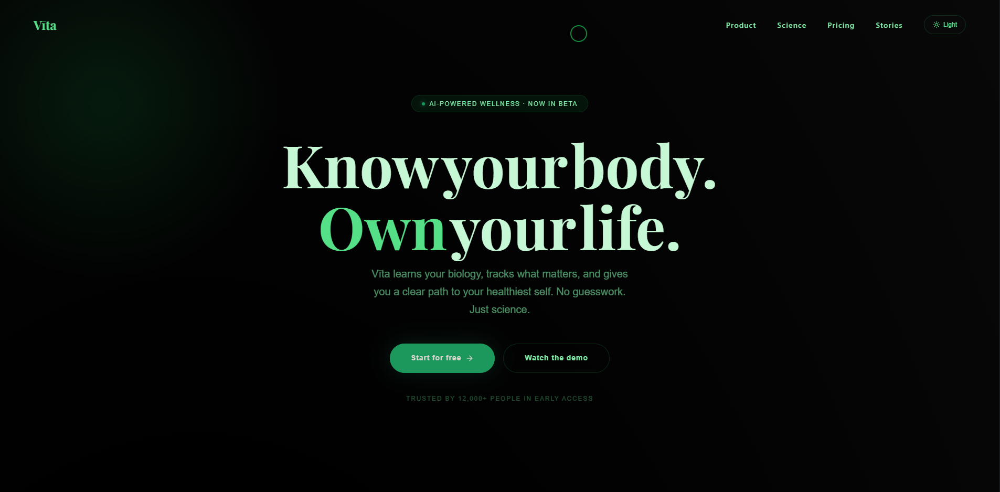

# Vīta — AI-Powered Health & Wellness Landing Page

> **Know your body. Own your life.**

A premium startup landing page built with React, Tailwind CSS, and Framer Motion — featuring dark/light mode, scroll-triggered animations, a fully animated product dashboard mockup, and a smooth pricing toggle.

🌐 **Live Site:** [vita-landing-five.vercel.app](https://vita-landing-five.vercel.app)

<figure>
  
  <figcaption>Hero section of Vita Landing Page.</figcaption>
</figure>

---

## ✨ Features

- **Dark / Light Mode** — Seamless toggle with smooth background transition
- **Custom Animated Cursor** — Spring-physics cursor with hover scale effect
- **Staggered Hero Animations** — Words animate in with blur and slide on load
- **Scroll-Triggered Reveals** — Every section animates in as you scroll
- **Fixed Ambient Orbs** — Breathing gradient orbs fixed to the viewport
- **Glassmorphism Cards** — Frosted glass effect with backdrop blur
- **Animated Product Dashboard** — Floating mockup with live bar chart, circular score, and mini stats
- **Floating Stat Cards** — Four cards drifting around the dashboard at different speeds
- **Scrolling Ticker Marquee** — Continuous social proof ticker built with requestAnimationFrame
- **Pricing Toggle** — Monthly / Annual switch with AnimatePresence price transitions
- **Floating Particles CTA** — Full-screen closing section with ambient particles
- **Fully Responsive** — Mobile-first layout across all sections

---

  Designed & built with intention. 🌿

